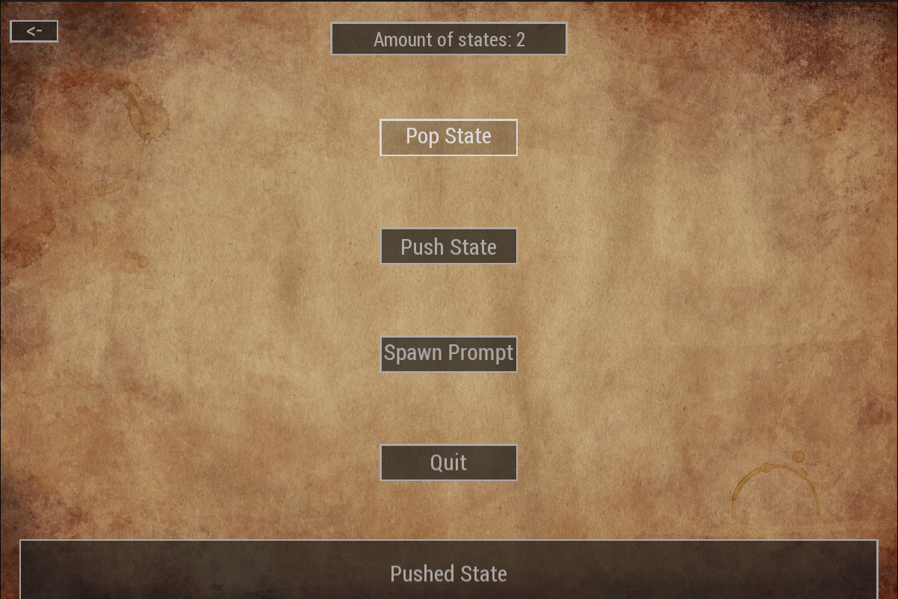
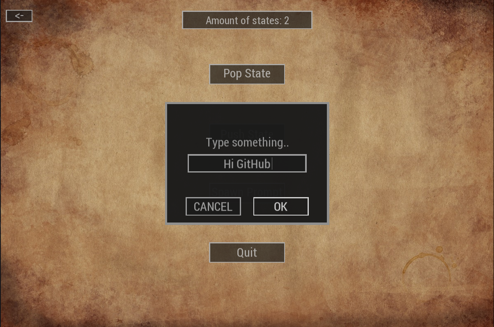

# skeleton
## Simple 2D application framework written in C++/SFML. 

**Skeleton** is a simple framework for creating apps and games using C++ and SFML. It has some tools that make creating new projects easier and faster. It comes with built-in classes such as Buttons, Popups, ResourceManager etc. so you can focus on other aspects of creating your app and stop worrying about creating GUI components or playing sounds - **Skeleton has it all!**

### Brief overview of Skeleton's modules and most important classes
- **GUI** - Contains all GUI based components
  - **Text** - Basic sf::Text wrapper with some more functionallity
  - **Box** - Basic sf::RectangleShape wrapper with some more functionallity
  - **TextBox** - Combination of Text and Box classes
  - **Button** - A clickable TextBox with callback
  - **InputBox** - A box which handles user's input
  - **Popup** - Can be used as an notifiaction
  - **Prompt** - Contains InputBox and Buttons and can act as a prompt window
- **States** - Contains State interface which is used with StateManager
  - **FrameworkSplashscreen** - an example of state that implements State interface
- **Managers** - All classes that help with managing the framework resources, states etc.
  - **CacheSystem** - Manages loading and caching resources such as sf::Texture, sf::SoundBuffer etc.
  - **AudioProvider** - Uses CacheSystem to play music and sounds (defalut implementation is SFMLSoundProvider)
  - **StateManager** - Manages State classes. Lets push new States and updates the current state
  - **ButtonManager** - Manages laying out the buttons, put's them in groups which results in nicely handled keyboard navigation
  - **bunch** of other Manager classes
- **Util**
  - **Animation** - (*work in progress*) Handles animating of GUI components
  - **Random** - Random integer/float distribution with range
  - **FPSCounter** - Useful utility to check the performance
  - **Math** - Some basic functions that I found helpful in creating SFML apps
- **Application** - Handles running the app, updating all managers, changing backgrounds etc.

## Example App
Skeleton provides an example `Sandbox` app that creates a simple menu state.
It shows how the buttons and state managing works. It also uses a background
using `CacheSystem`.
Here are example screenshots of the Sandbox app using Skeleton framework

### Main menu

### Handling user input


# How to build

## CMake
Download [SFML](https://www.sfml-dev.org/download/sfml/2.5.1/) compatible with your compiler and extract it to folder
in the project or use your package manager to download the library.

## Linux
Root project Makefile takes care of building the project. It accepts two flags that are passed to CMake.
* `CMAKE_BUILD_TYPE` - the build type. If not specified `Debug` is used.
* `SFML_DIR` - CMake configuration path. This should be used when SFML was installed manually to tell `find_package` where
to search SFML for.
### Example: Linux with defualt parameters
```
make
build/Sandbox
```

### Example: Linux with non default parameters
This shows `CMAKE_BUILD_TYPE` and `SFML_DIR` passed as parameters. This assumes SFML was downloaded and extracted in
`vendor` folder.
```
make CMAKE_BUILD_TYPE=Release SFML_DIR=vendor/SFML-2.5.1/lib/cmake/SFML
build/Sandbox
```

## Windows
### Example: Windows Visual Studio
CMake should take care of creating the solution files. As this example does not use Makefile, you need to pass the
`SFML_DIR` parameter directly to CMake:
```
mkdir build
cd build
cmake -DSFML_DIR="vendor\SFML-2.5.1\lib\cmake\SFML"  ..

# for 32 bit version:
# cmake -A Win32 -DSFML_DIR="vendor\SFML-2.5.1\lib\cmake\SFML"  ..
```
After that open generated solution file and hit build. 
Copy needed dlls to binary location.
Note: You may need to set Sandbox as the startup project.

### Example: Windows MinGW Makefiles
This works similiar to the previous example but uses different generator.
```
mkdir build
cd build
cmake -G "MinGW Makefiles" -DSFML_DIR="vendor\SFML-2.5.1\lib\cmake\SFML"  ..
make
# run the app after copying dll files
Sandbox.exe
```

## Skeleton resources folder
Skeleton resources folder is located in `res` folder in the root of the project.
CMake sets the absolute path to this folder as a `RESOURCES_DIR` macro available in the code.
This is then used by the `CacheSystem` in order to find the resources.

This lets users to run the app from anywhere as long as the resources folder is in the same place
as when the app was built.

### Tested on:
* Ubuntu using libsfml-dev package. This is also used for CI builds.
* Arch using sfml package.
* Windows using Visual Studio 2019 with SFML for Visual Studio 2015 32-bit version.
* Windows using MinGW Makefiles with SFML for GCC 7.3.0 32-bit version.

## Skeleton used in other projects:
* [szykol/Tetris](https://github.com/szykol/Tetris) - simple tetris game that uses Skeleton to manage the game state
and menus.
